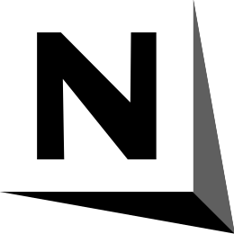

  

<h1 align="center">NoteBox</h1>

  A lightweight, fast, and modern note-taking application.  
   
  An open-source Notion-style text editor built with C# / .NET.

---

## ✨ Features

- 🔤 **Text zoom controls**  
  `Ctrl +` to zoom in  
  `Ctrl -` to zoom out  
  (+ toolbar buttons available)

- 🔄 **Undo / Redo support**  
  `Ctrl Z` and `Ctrl Y` + button options

- 🧮 **Word & character counter**  
  Updates automatically as you type.

- 📐 **Line & column indicator**  
  Displays your current cursor position in real time.

- 📁 **Save as .txt file**  
  Choose any directory and export your notes effortlessly.

- ✍️ **Acrostic mode (RightMargin)**  
  Toggle on/off with a single CheckBox.

- 🧪 ***Experimental* margin mode**  
  Enables `ShowSelectionMargin` (may behave differently on some systems).

- ⚡ **Fully local**  
  No internet required. Opens and runs instantly.

---

🚀 **Installation**
1) Download the latest release

Go to the Releases section on GitHub and download the newest build of NoteBox.

2) Run the application

Inside the downloaded folder, you will find:

- test.exe

- test.dll

- test.deps.json

- logo.png

You can move the folder anywhere and run the app directly.

⌨️ **Keyboard Shortcuts**

Shortcut	Actions:
- Ctrl +	Zoom in
- Ctrl -	Zoom out
- Ctrl Z	Undo
- Ctrl Y	Redo
- Ctrl S	Save
- Ctrl A	Select all
- Ctrl C / V / X	Copy / Paste / Cut

🛣 **Roadmap**

 - Theme support (Dark mode, Solarized, etc.)

 - Export as Markdown

 - Tabbed interface

 - Auto-save feature

 - Spell-checking

 - Linux & macOS version (Avalonia UI)

 - NoteBox Web (long-term)

🤝 **Contributing**

Contributions are welcome!
Feel free to open an issue or submit a pull request.
Feature ideas and bug reports help NoteBox grow.

📜 **License**

This project is licensed under the Apache License 2.0.
See the LICENSE file for full details.

⭐ **Support the Project**

If you enjoy using NoteBox, consider giving the repository a ⭐!
It helps the project gain visibility and motivates future development.
